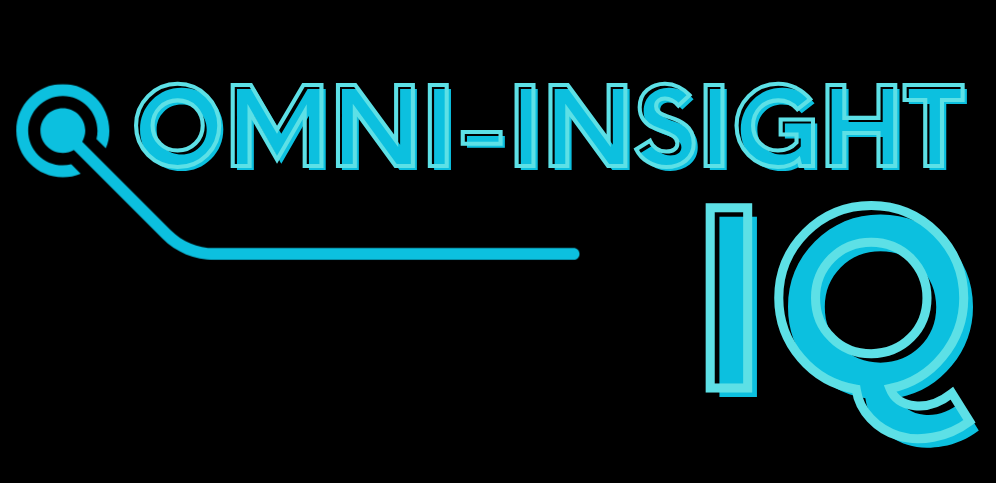

<p align="center">
  
</p>
<p align="center"><strong>AI-Driven Performance & Engagement Intelligence Platform</strong></p>

# OmniInsight IQ (OIIQ)
AI-Driven Performance & Engagement Intelligence Platform

## Overview
OmniInsight IQ (OIIQ) is a modular, enterprise-grade intelligence platform designed to support consulting-led decision-making through scalable data engineering, AI-driven analytics, and explainable insight delivery.

The platform unifies performance analytics, engagement intelligence, and AI-assisted reasoning within a single, extensible architecture. OIIQ demonstrates how modern AI systems—built around LLMs, RAG pipelines, and cloud-native services can be applied across multiple business domains while maintaining a consistent, scalable foundation.

OIIQ is developed as a solo, end-to-end system and serves as a real-world reference implementation for AI-first software engineering, data systems design, and intelligent automation in enterprise and consulting environments.

## Key Objectives
- Translate complex, multi-source data into actionable, executive-ready insights
- Enable AI-assisted analysis and decision support using LLM-driven workflows
- Demonstrate production-grade GenAI architecture, not prototypes
- Support modular domain adaptation without rewriting core systems
- Reflect consulting-ready engineering standards (clarity, explainability, scalability)

## Core Platform Capabilities
### 1. Performance & Engagement Intelligence
- Unified analytics layer for operational, behavioral, and performance data
- Engagement scoring and trend analysis across time, segments, and entities
- KPI modeling aligned with consulting and executive reporting workflows

### 2. AI-Driven Analytics & Reasoning
- LLM-powered insight generation and contextual analysis
- Retrieval-Augmented Generation (RAG) for grounded, explainable responses
- Vector search and semantic indexing for large, unstructured datasets

### 3. Modular Domain Architecture
- Core intelligence engine is domain-agnostic
- Domain layers (e.g., commercial performance, engagement analytics) are injected via configuration and data models
- Demonstrates adaptability across industries while maintaining architectural consistency

### 4. IO Studio (Insight Operations Layer)
- Specialized intelligence layer focused on engagement, performance drivers, and operational signals
- Supports consulting-style workflows: diagnostics → insight → recommendation
- Designed to simulate internal consulting and analytics tooling

## Technical Architecture
### High-Level Design
```
[ Data Sources ]
      ↓
[ ETL / ELT Pipelines ]
      ↓
[ Data Models & Feature Engineering ]
      ↓
[ Vector Index + Relational Store ]
      ↓
[ AI Services (LLM / RAG / Agents) ]
      ↓
[ API Layer (FastAPI) ]
      ↓
[ Analytics Dashboards & Interfaces ]
```

### Technology Stack
#### Backend & AI
- Python
- FastAPI (API & service layer)
- LangChain / LlamaIndex / AutoGen (LLM orchestration)
- Pydantic (data validation & schema enforcement)
- LLM Providers (OpenAI-compatible APIs)
- RAG Pipelines with vector databases (FAISS / Pinecone / Chroma)

#### Data & Analytics
- PostgreSQL
- SQL
- ETL / ELT workflows
- Feature engineering & analytics modeling
- Vector embeddings & semantic search

#### Cloud & Infrastructure
- AWS / GCP (cloud-agnostic design)
- Docker
- Git / GitHub
- CI/CD-ready architecture

#### Frontend (Reference Implementation)
- React / Next.js
- Interactive dashboards for insight exploration
- API-driven visualizations

## Design Principles
### AI-First, Not AI-Added
AI is embedded into system design, not layered on top.

### Explainability Over Black Boxes
Insights are traceable to data sources and reasoning steps.

### Modularity & Reuse
Core systems are reusable across domains and use cases.

### Consulting-Ready Outputs
Every feature supports interpretation, narrative, and recommendation.

### Production-Grade Standards
Strong typing, validation, error handling, and scalability considerations throughout.

## Example Use Cases
- Executive performance diagnostics
- Engagement trend analysis
- AI-assisted insight summarization
- Consulting scenario analysis
- Data-driven recommendations for optimization initiatives

## Project Scope & Intent
OIIQ is not a demo application.

It is intentionally built to reflect:
- Enterprise software engineering practices
- Real-world GenAI system design
- Consulting-style analytics workflows
- Scalable, maintainable architecture

The platform is used as a reference system for demonstrating proficiency in:
- AI-first application development
- Data systems engineering
- Intelligent automation
- Cloud-native architecture
- Consulting-aligned analytics delivery

## Status
Active Development

The platform continues to evolve with additional:
- AI evaluation frameworks
- Advanced agentic workflows
- Domain-specific intelligence modules
- Performance and cost optimization layers

## Author
Developed and maintained by Balla Cisse (B)

Full-Stack Engineer 

## License
This project is provided for demonstration and evaluation purposes.

Commercial use requires authorization.
